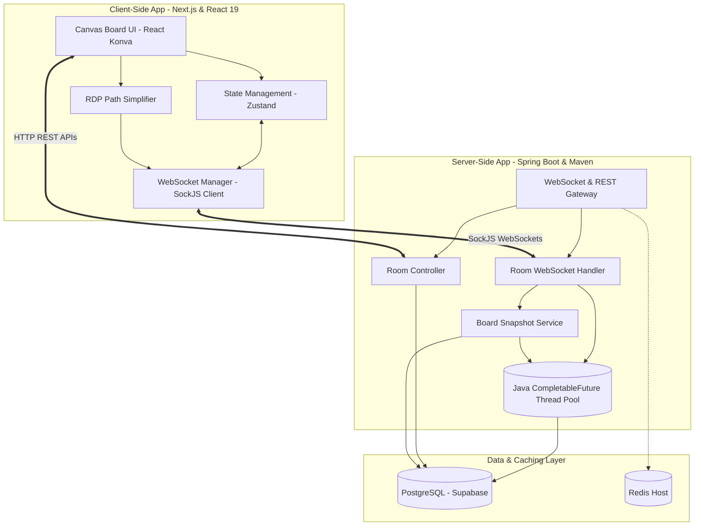
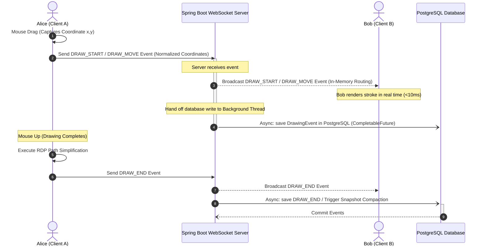

# ⚡ Visync — Realtime Collaborative Whiteboard Platform

[](https://nextjs.org/)
[](https://react.dev/)
[](https://spring.io/projects/spring-boot)
[](https://konvajs.org/)
[](https://zustand-demo.pmnd.rs/)
[](https://www.postgresql.org/)
[](https://redis.io/)
[](https://tailwindcss.com/)

Visync is a state-of-the-art, high-performance **realtime collaborative whiteboard platform** designed for technical interviews, brainstorming, online teaching, and instant team diagramming. 

By leveraging a server-authoritative, event-driven architecture, Visync achieves **ultra-low latency synchronization (sub-1ms server-side routing)**. The system includes responsive vector drawing, persistent history recovery, resolution-independent coordinates, floating live cursors, in-room presence, and built-in chat.

---

## 🌟 Core System Features

### 🖌️ Interactive Whiteboard Canvas
* **Vector Drawing Tools**: Includes a freehand `Pen` tool and precise shape renderers for `Lines`, `Rectangles`, and `Circles`.
* **Adaptive Eraser**: Smart chalk-background erase strokes designed to cleanly remove overlapping shapes.
* **Canvas Settings**: Instant configuration dock containing a sleek, curated premium HSL color palette and adjustable stroke widths (`2px`, `4px`, `8px`, `12px`, `20px`).
* **Zoom & Pan Controls**: Infinite-style viewport manipulation. Zoom in/out via dynamic mouse wheel scroll centering on the mouse pointer (from `10%` to `1000%`) or use the grab/pan hand tool to drag the whiteboard board.
* **Grid Layout Background**: Built-in micro-grid background pattern to assist in visual alignment and precise diagram structure.
* **Export Canvas**: Instantly export the fully rendered workspace as a premium white-background high-definition PNG image directly to your local system.

### 👥 Realtime Collaboration & Presence
* **Multi-User Sync**: Multiple participants can draw, erase, and write simultaneously with zero desynchronization.
* **Floating Live Cursors**: Smooth tracking of active user mouse positions across the screen, using a throttled and highly responsive coordinate feed.
* **Collaboration Badge Presence**: Automatic dynamic user avatars rendering in the room header, updating instantly on new user joins or departures.
* **In-Room Live Chat**: Integrated group text chat for instant communication during diagramming, featuring auto-scroll locks and distinctive user styling.
* **Dynamic Invite Flows**: Seamless copy-to-clipboard room code and single-click shareable URL invite links.

### ⚡ Performance & Data Optimization
* **Sub-1ms Server-Side Routing**: The backend processes and routes WebSocket drawing frames to other active sockets instantly by removing blocking operations.
* **Asynchronous Non-Blocking Database Writes**: DB persistence of drawing steps is detached from the connection cycle and executed asynchronously in background threads via `CompletableFuture`.
* **Client-Side Ramer-Douglas-Peucker (RDP) Path Simplification**: Reduces stroke vector point counts by up to **90%** before finalizing DB logs, conserving network bandwidth and database rows without sacrificing path curves.
* **Hybrid Snapshot Compaction**: Periodically merges individual drawing points into a single consolidated JSON state. This prevents database bloat and ensures instantaneous room load times on fresh page visits.
* **Step-by-Step Undo/Redo Engine**: Local and remote synchronized undo/redo histories that automatically align between room participants in real time.

---

## 🏗️ Technical Architecture & Design

Visync is structured with a decoupled Frontend and Backend system communicating via **HTTP REST** (for session initialization and history recovery) and **WebSockets via SockJS** (for high-frequency collaborative synchronization).

### 🌌 High-Level System Architecture



---

## 🔄 Sequence Flows

### 1. Drawing Synchronization Sequence

To achieve sub-1ms server routing times, the backend utilizes a non-blocking asynchronous pipeline:



---

### 2. Hybrid State Compaction Mechanism

Every stroke consists of a `DRAW_START` event, multiple high-frequency `DRAW_MOVE` events, and a final `DRAW_END` event. Storing all raw points indefinitely would cause massive query latency on loading a board. 

Visync implements **Hybrid State Compaction** to keep database tables compact:

```mermaid
graph LR
    subgraph Raw Event Logs [High-Frequency Database Rows]
        E1[DRAW_START] --> E2[DRAW_MOVE 1]
        E2 --> E3[DRAW_MOVE 2]
        E3 --> E4[DRAW_MOVE ...]
        E4 --> E5[DRAW_END]
    end

    subgraph Compaction Engine [BoardService.compactSnapshot]
        Parser{Consolidate Points into Single JSON Stroke Array}
    end

    subgraph Compacted Snapshots [Slim Database Rows]
        Snapshot[(BoardSnapshot: JSONB Board State)]
    end

    Raw Event Logs -->|Triggered on DRAW_END or Room Close| CompactionEngine
    CompactionEngine -->|1. Write Consolidated Snapshot| Snapshot
    CompactionEngine -->|2. Delete Raw DrawingEvents| Raw Event Logs
```

---

## 📐 Virtual Coordinate System (Resolution Independence)

To ensure that drawings align perfectly regardless of whether a user is working on an ultra-wide desktop monitor, a tablet, or a laptop screen, Visync implements a **Resolution-Independent Virtual Coordinate System**:

1. **Virtual Resolution Layer**: The canvas is mapped internally to a logical scale of **`1920 x 1080` pixels**.
2. **Client-Side Coordinate Normalization**:
   When drawing, mouse coordinates `(x, y)` captured from the browser viewport are mapped through the Konva stage transform inversion and normalized to a relative `0.0 to 1.0` scale:
   $$\text{Normalized } X = \frac{\text{Virtual } X}{1920}$$
   $$\text{Normalized } Y = \frac{\text{Virtual } Y}{1080}$$
3. **Broadcasting**: Only these normalized decimals (`x`, `y`) are transmitted over WebSockets.
4. **Target Rendering**: Receiving clients scale these relative decimals back to their viewport screen dimensions by multiplying them by `1920` and `1080` within their scaled stage ref, maintaining exact proportions.

---

## ⚡ Latency & Network Optimization Metrics

Visync is heavily optimized for lightning-fast responsiveness. Below are typical metrics observed in a standard production deploy:

| Metric Category | Target Value | Implementation Secret |
| :--- | :--- | :--- |
| **Local Interaction Latency** | **`~0ms`** | React Konva renders drawing vectors instantly inside the client's local frame buffer before transmitting to the network. |
| **Server-Side WebSocket Routing** | **`<1ms`** | Non-blocking `TextWebSocketHandler` uses local `ConcurrentHashMap` socket sets. No synchronous DB query or processing is allowed on the WebSocket thread. |
| **Average End-to-End Client Sync** | **`15ms - 50ms`** | Driven purely by client network round-trip time (RTT). Zero server overhead. |
| **Workspace Recovery Load Time** | **`<150ms`** | Fresh page visits fetch the compacted `BoardSnapshot` (single DB row query) plus only the tiny uncompacted delta of `DrawingEvent`s. |
| **Network Payload Size Reduction** | **`up to 90%`** | Client-side RDP Path Simplification strips redundant vector coordinates from freehand drawing strokes on `DRAW_END`. |

---

## 💾 Database Schema

Visync uses PostgreSQL for structured data persistence. Below are the key entity models:

### 1. `Room` Table
Stores details of the collaboration room session.
```sql
CREATE TABLE room (
    id UUID PRIMARY KEY DEFAULT gen_random_uuid(),
    name VARCHAR(255) NOT NULL,
    created_by VARCHAR(255) DEFAULT 'Guest',
    created_at TIMESTAMP WITH TIME ZONE DEFAULT CURRENT_TIMESTAMP,
    is_active BOOLEAN DEFAULT TRUE
);
```

### 2. `DrawingEvent` Table
Stores recent incremental drawing coordinate segments since the last snapshot.
```sql
CREATE TABLE drawing_event (
    id BIGINT GENERATED ALWAYS AS IDENTITY PRIMARY KEY,
    room_id UUID REFERENCES room(id) ON DELETE CASCADE,
    user_id VARCHAR(255) NOT NULL,
    event_type VARCHAR(50) NOT NULL, -- DRAW_START, DRAW_MOVE, DRAW_END
    payload TEXT NOT NULL,           -- Stringified JSON containing coordinates & tool config
    timestamp BIGINT NOT NULL
);
```

### 3. `BoardSnapshot` Table
Holds the compacted board vector stroke state. When a snapshot is generated, all corresponding rows are deleted from `drawing_event`.
```sql
CREATE TABLE board_snapshot (
    id UUID PRIMARY KEY DEFAULT gen_random_uuid(),
    room_id UUID REFERENCES room(id) ON DELETE CASCADE,
    board_state TEXT NOT NULL,       -- Compacted JSON Array representing all final strokes
    created_at TIMESTAMP WITH TIME ZONE DEFAULT CURRENT_TIMESTAMP
);
```

### 4. `ChatMessage` Table
Stores all chronological group text logs within a room.
```sql
CREATE TABLE chat_message (
    id BIGINT GENERATED ALWAYS AS IDENTITY PRIMARY KEY,
    room_id UUID REFERENCES room(id) ON DELETE CASCADE,
    sender_id VARCHAR(255) NOT NULL,
    sender_name VARCHAR(255) NOT NULL,
    message VARCHAR(1000) NOT NULL,
    timestamp BIGINT NOT NULL
);
```

---

## 🛠️ Local Setup & Configuration

Follow these steps to configure and boot Visync on your local workstation.

### Prerequisites
* **Java 17 SDK** (or higher)
* **Node.js** (v18.x or higher) + `npm`
* **PostgreSQL** instance (hosted on Supabase or running locally)
* **Redis** (Optional / Default configuration looks for localhost:6379)

---

### 1. Backend Setup (Spring Boot)

1. Navigate to the backend directory:
   ```bash
   cd backend
   ```

2. Copy the sample environment file or create `.env` in the `backend/` folder:
   ```env
   SUPABASE_PASSWORD=your_database_password_here
   ```

3. Update Database Configuration in `backend/src/main/resources/application.properties`:
   ```properties
   spring.datasource.url=jdbc:postgresql://<your-db-host>:<port>/<db-name>
   spring.datasource.username=postgres
   spring.datasource.password=${SUPABASE_PASSWORD}
   
   spring.redis.host=localhost
   spring.redis.port=6379
   server.port=8080
   ```
   > [!TIP]
   > For local PostgreSQL setups, you can change the driver url to `jdbc:postgresql://localhost:5432/visync`.

4. Build and clean the backend using Maven:
   ```bash
   ./mvnw clean install
   ```

5. Launch the application:
   ```bash
   ./mvnw spring-boot:run
   ```
   The backend server will spin up on **`http://localhost:8080`** and host the WebSocket endpoint at `ws://localhost:8080/ws/rooms`.

---

### 2. Frontend Setup (Next.js & React)

1. Navigate to the frontend directory:
   ```bash
   cd ../frontend
   ```

2. Create a `.env.local` configuration file:
   ```env
   NEXT_PUBLIC_API_URL=http://localhost:8080
   NEXT_PUBLIC_WS_URL=ws://localhost:8080
   ```

3. Install the application dependencies:
   ```bash
   npm install
   ```

4. Boot the Next.js development server:
   ```bash
   npm run dev
   ```

5. Open your browser and navigate to **`http://localhost:3000`** to launch the Visync portal!

---

## 🧪 Verification & Testing API Docs

Visync comes equipped with HTTP REST endpoints for retrieving rooms and session histories.

### REST Endpoints
* **Create Room**: `POST /api/rooms`
  * Payload: `{"name": "Architecture Jam", "createdBy": "Alice"}`
* **Get Room Details**: `GET /api/rooms/{roomId}`
* **Retrieve Session History**: `GET /api/rooms/{roomId}/history`
  * Returns: Consolidated snapshot `boardSnapshot`, list of recent coordinate deltas `recentEvents`, and all active `chatHistory`.

### WebSocket Events Protocol
All real-time communications are routed in JSON format conforming to the `DrawEvent` structure:
```json
{
  "eventType": "DRAW_START",
  "roomId": "0185bf2d-2ba6-455b-b9f0-28be93fe28ab",
  "userId": "usr_998",
  "timestamp": 1780070520000,
  "payload": {
    "strokeId": "usr_998-1780070520",
    "color": "#2563eb",
    "strokeWidth": 3,
    "tool": "pen",
    "point": {"x": 0.452, "y": 0.123}
  }
}
```

---

## 💡 Architectural Best Practices

* **Active Presence Flushing**: When the last active WebSocket session disconnects from a room, the server automatically flushes the final board snapshot compaction and marks the room as `inactive` in the database.
* **Cold Database Graceful Reconnections**: The frontend SockJS WebSocket client implements custom **Exponential Backoff Reconnection Logic** (`1.5s`, `3s`, `6s`, `12s`, `24s`), ensuring connection stability during database wakeups or temporary server redeploys.
* **Preventing Canvas Coordinate Bloat**: Always keep the client-side RDP simplification tolerance configured around `0.0005`. Raising the tolerance reduces row counts further but might make freehand circles look like octagons; dropping it to `0` disables compaction completely and floods database networks.
